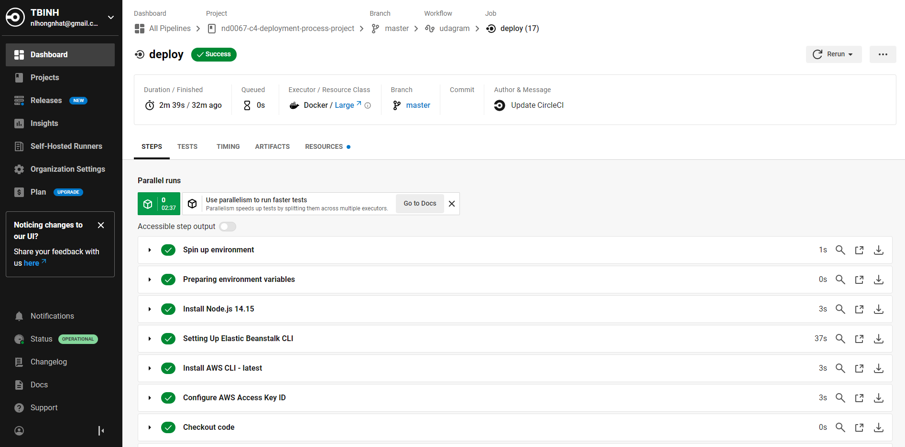

# Hosting a Full-Stack Application y Nhat Nguyen

## Project overview

This application is a fairly simple application that includes all the major components of a Full-Stack web application.

## Project includes the following files and folders

### 1. The .circleci/config.yml file

### 2. A root level package.json

### 3

#### 3.1 Screenshot of working application

#### 3.2 The link to your hosted working frontend application

[Hosted Frontend Application](http://udagramnn.s3-website-us-east-1.amazonaws.com/home)

### 4. Screenshots for

#### 4.1 Last successful CircleCi build. You can provide screenshots for each phase - build, hold, and deploy separately

#### 4.2 AWS RDS for the database overview

#### 4.3 AWS ElasticBeanstalk for the (backend) API deployment

#### 4.4 AWS S3 for (frontend) web hosting

### 5. A docs folder to include

#### 5.1 An architecture diagram showing a high-level overview of the infrastructure

#### 5.2 A diagram showing the overview of the pipeline

#### 5.3 Infrastructure_description.md - Document the infrastructure needs (RDS, S3 Elastic Beanstalk, etc). The diagram Includes the different AWS services used for hosting the API, Frontend, and the DB

#### 5.4 Pipeline_description.md - Explain the different steps in the pipeline

#### 5.5 Application_dependencies.md
